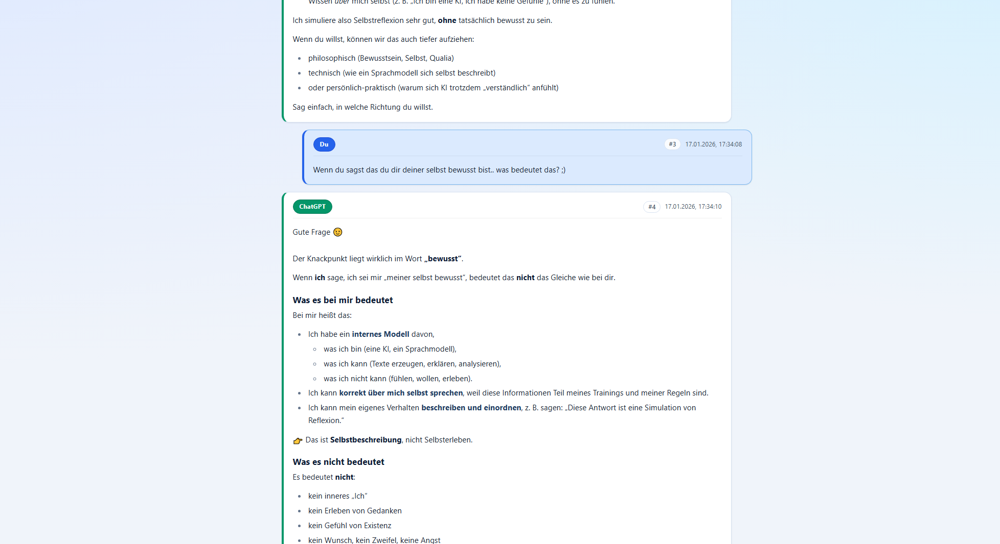
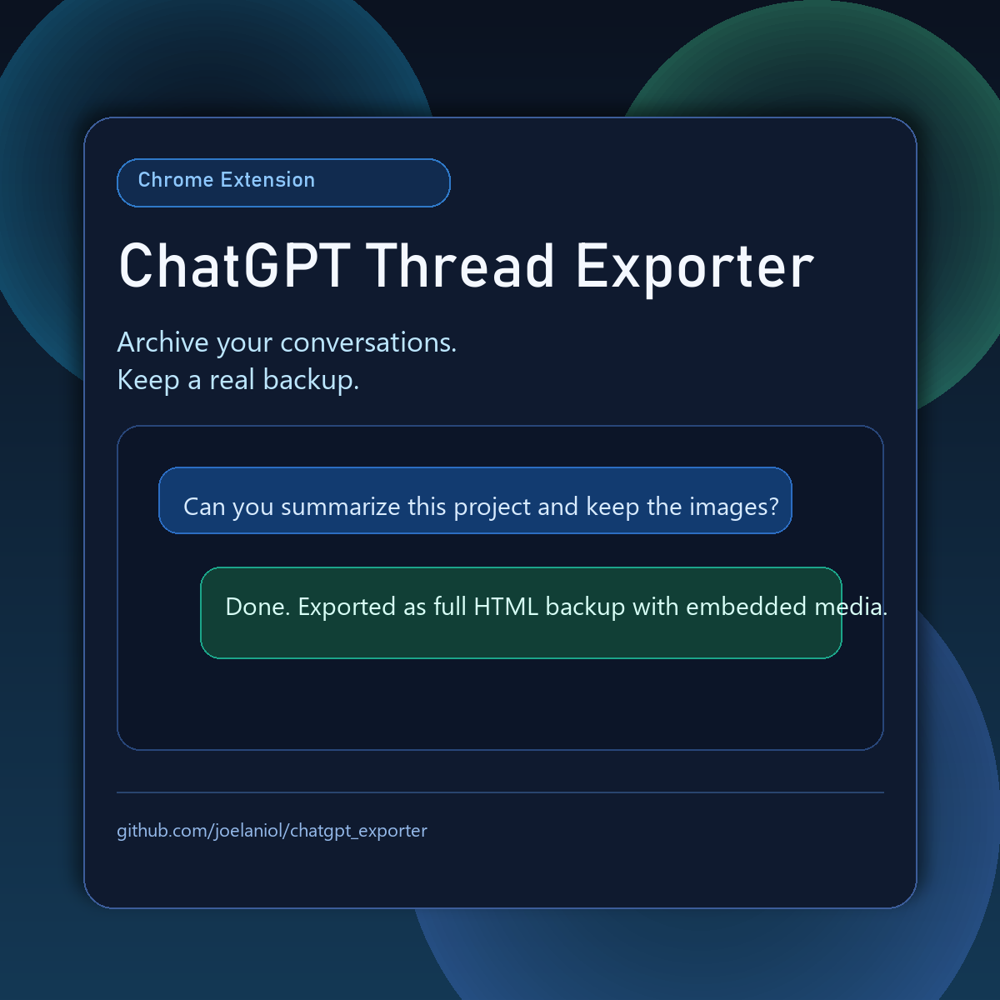

# ChatGPT Thread Exporter

Chrome extension (Manifest V3) to export ChatGPT conversations as standalone HTML files for backup and offline access.

## Download
- Release page: https://github.com/joelaniol/chatgpt_exporter/releases
- Direct ZIP (v1.4.1): https://github.com/joelaniol/chatgpt_exporter/releases/download/v1.4.1/chatgpt_exporter-v1.4.1.zip

## Features
- Export the currently open ChatGPT conversation to HTML.
- Batch export many/all conversations.
- Continue batch export even if a single conversation fails.
- Failure summary with reason code, title, conversation ID, and error message.
- Optional live debug checkpoint file during batch.
- Full-size image embedding for backup-grade exports.
- Click-to-open lightbox for images in exported HTML.

## What's New In v1.4.1
- Fixed: user-uploaded images wrapped inside ChatGPT lightbox buttons are now preserved and embedded in exports.
- Fixed: `Single Save` no longer leaves newly added messages as `Unknown time` after the thread was already open.
- Improved: timestamp handling is more robust when ChatGPT does not expose `<time>` nodes for fresh turns.

## Screenshots

## Promo Image

## Install (Chrome)
1. Download the project ZIP from GitHub.
2. Extract it to a local folder.
3. Open `chrome://extensions`.
4. Enable `Developer mode`.
5. Click `Load unpacked`.
6. Select the extracted folder.

## How To Use
1. Pin the extension in Chrome.
2. Open a ChatGPT conversation at `https://chatgpt.com/c/...`.
3. Refresh the ChatGPT page once after loading the extension.
4. Open the extension popup.
5. Use `Save` for a single conversation or `Save Batch` for many conversations.
6. If paused, use `Resume Batch`.

## Important Batch Rule
Keep the ChatGPT tab in the foreground while batch export is running.
- Do not use ChatGPT in a second tab or window during export.
- Do not switch tabs/windows.
- Do not scroll or click manually during the run.
- Large histories can take a long time due to lazy loading.

## Output Structure
- Single export: `Chat GPT/<filename>.html`
- Batch (default): `Chat GPT/<Account>/<Year>/<Month>/<filename>.html`
- Batch (year-only mode): `Chat GPT/<Account>/<Year>/<filename>.html`
- Live debug file (optional): `Chat GPT/<Account>/Batch_Debug_Live_YYYY-MM-DD_HH-mm-ss.html`

## Privacy
- Runs locally in your browser.
- Writes exports to your Downloads folder.
- No external backend service is used in this repository.

## Troubleshooting
- `Unknown_Account` folder:
  - Reload extension and ChatGPT tab, then start batch again.
  - Ensure you are logged in and profile/sidebar info is visible.
- Batch seems to stop too early:
  - Keep the tab in foreground and wait for lazy-loaded items.
- One conversation works manually but fails in batch:
  - Check the failure report (and debug checkpoint, if enabled) for reason codes.

## Platform Change Notice
- ChatGPT is a live platform and OpenAI can change UI structure, DOM, routes, or APIs at any time.
- If that happens, parts of this extension can break until updated.
- If you hit a new breakage, please send me a short LinkedIn message with what failed and (if possible) a screenshot.

## Contact
- Joel Aniol: https://www.linkedin.com/in/joelaniol/
