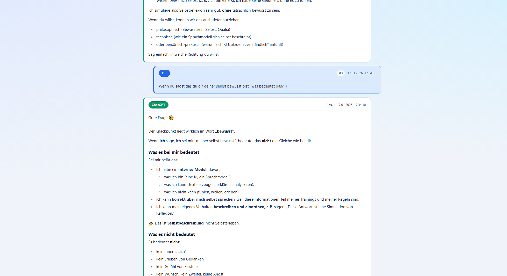
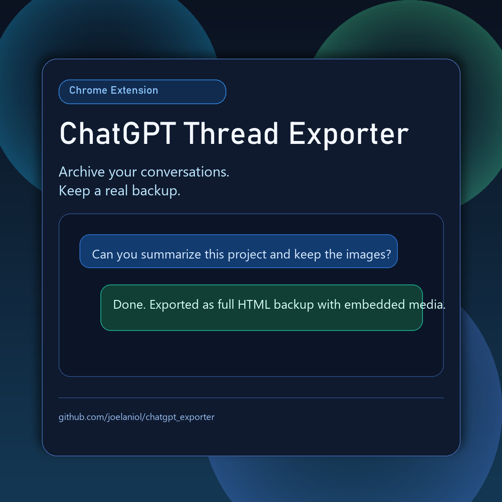

# Save GPT Chats

Save your ChatGPT chats to your Downloads folder as Web Page (HTML), Text File (TXT), or Markdown (MD).

## Download
- Release page: https://github.com/joelaniol/save-gpt-chats/releases
- Direct ZIP (v1.5.1): https://github.com/joelaniol/save-gpt-chats/releases/download/v1.5.1/save-gpt-chats-v1.5.1.zip

## Features
- Save the chat you currently have open.
- Save many or all chats in one run.
- Choose HTML for easiest reading, TXT for plain text, or MD for Markdown.
- Continue a paused multi-chat save later.
- Optional extra help file for long multi-chat runs.
- Large images stay included in HTML exports.

## What's New In v1.5.1
- New export formats: **Text File (TXT)** and **Markdown (MD)** alongside HTML.
- Optional detailed metadata toggle for TXT and Markdown exports.
- Simpler, cleaner popup interface.
- More robust export handling and error recovery.
- Renamed from ChatGPT Exporter to **Save GPT Chats**.

## What's New In v1.4.1
- Uploaded images are saved more reliably.
- Message times stay more accurate in active chats.
- Overall saving is more reliable when ChatGPT loads slowly.

## Screenshots

## Promo Image

## Install (Chrome)
1. Download the project ZIP from GitHub.
2. Extract it to a local folder.
3. Open `chrome://extensions`.
4. Enable `Developer mode`.
5. Click `Load unpacked`.
6. Select the extracted folder.

## How To Use
1. Pin the extension in Chrome.
2. Open ChatGPT.
3. Refresh the ChatGPT page once after loading the extension.
4. Open the extension popup.
5. Use `Save This Chat` for the chat you are viewing.
6. Use `Save Many Chats` for a larger backup.
7. If a multi-chat run pauses, use `Continue Saving`.

## Quick Tip
- If you are unsure which file type to choose, use `Web Page (HTML)`.
- It is the easiest version to open and read later.

## File Types
- `Web Page (HTML)`: Best if you want the export to look close to ChatGPT.
- `Text File (TXT)`: Best if you want simple plain text.
- `Markdown (MD)`: Best if you want Markdown.

## When Saving Many Chats
Keep the ChatGPT tab open and visible while the save is running.
- Do not switch to another tab or window.
- Do not scroll or click inside ChatGPT during the run.
- Large chat libraries can take a while.

## Output Structure
- Single-chat files are saved inside `Downloads/Chat GPT`.
- Multi-chat files are grouped inside `Downloads/Chat GPT/<Account>/<Year>/<Month>`.
- If year-only mode is turned on, month folders are skipped.
- Optional help files are saved inside the same account folder.

## Privacy
- Runs locally in your browser.
- Writes exports to your Downloads folder.
- No external backend service is used in this repository.

## Troubleshooting
- Chats are saved into an `Unknown_Account` folder:
  - Reload the extension and the ChatGPT tab, then try again.
  - Make sure you are logged in and your sidebar/profile area is visible.
- A multi-chat run pauses or stops early:
  - Keep the ChatGPT tab visible and wait for all chats to load.
- Some chats fail during a large run:
  - Open the help report or optional help file to see which chats had trouble.

## Platform Change Notice
- ChatGPT changes over time, and parts of the website can move or behave differently.
- If that happens, parts of this extension may need an update.
- If you hit a new breakage, please send me a short LinkedIn message with what failed and (if possible) a screenshot.

## For Developers
- Build release ZIP locally: `powershell -ExecutionPolicy Bypass -File .\scripts\build-release.ps1`
- Output: `release/save-gpt-chats-v<version>.zip`
- The script uses a strict allowlist and verifies there are no extra files in the ZIP.

## Contact
- Joel Aniol: https://www.linkedin.com/in/joelaniol/
